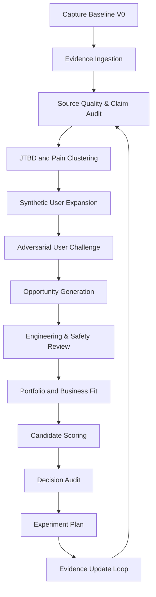

# AI-Native Product Design Workflow V2

## 1. 工作流目标

建立一条有证据门槛、有反方机制、有结构化输出的产品定义流水线。

## 2. 核心对象

### EvidenceRecord

记录每条证据：

- 来源类型；
- 来源链接；
- 观察到的现象；
- 可支持的假设；
- 不能支持的结论；
- 证据强度；
- 是否存在反方证据；
- 核验日期。

### HypothesisRecord

记录每个假设：

- 假设内容；
- 来源；
- 当前证据；
- 反方证据；
- 技术风险；
- 下一步测试；
- 状态：保留 / 修正 / 暂缓 / 否决。

### CandidateConcept

记录候选产品：

- 目标用户；
- JTBD；
- 核心结构；
- 必须功能；
- 明确非目标；
- 关键风险；
- 与竞品差异；
- 验证方案。

### AgentEvaluation

每个专家只评价其负责的维度，不能直接代替总决策。

## 3. 八个角色与权限边界

### A01 — Research Scout

输入：关键词、产品类别、目标用户。  
输出：EvidenceRecord 列表。  
不能做：根据帖子数量推断市场发生率。

### A02 — Insight Synthesizer

输入：证据记录。  
输出：JTBD、痛点聚类、矛盾需求。  
必须保留：来源 ID 和冲突证据。

### A03 — Synthetic User Lab

输入：JTBD 与候选概念。  
输出：多类用户情境。  
必须包含：
- 支持者；
- 无痛点者；
- 价格反对者；
- App 厌恶者；
- 安全敏感者；
- 极简旅行者。

不能做：把合成用户支付意愿当事实。

### A04 — Devil's Advocate

输入：候选概念和支持证据。  
输出：
- 最强反对理由；
- 已有替代方案；
- 可能被高估的痛点；
- 失败前提；
- 否决条件。

### A05 — Power & Electronics Expert

输入：产品框图和功率目标。  
输出：
- 输入输出边界；
- USB PD 约束；
- 温升与保护风险；
- 可检测和不可检测的数据；
- 需要实体测试的项目。

### A06 — Mechanical & Industrial Design Expert

输入：尺寸、质量、重心和结构方案。  
输出：
- 墙端力矩；
- 插座空间适配；
- 线长和弯折约束；
- 模块丢失与触点可靠性；
- 工业设计取舍。

### A07 — Safety & Compliance Expert

输入：地区模块、电气架构和使用场景。  
输出：
- 电压转换误用风险；
- 接地策略；
- 额定电流；
- 安规认证清单；
- 禁止宣传的未经验证能力。

### A08 — Decision Auditor

输入：全部 Agent 输出。  
输出：
- 结论—证据映射；
- 低证据主张；
- Agent 冲突；
- 需要人工裁决的项目；
- 决策版本和理由。

## 4. 证据门槛

| 决策类型 | 最低门槛 |
|---|---|
| 进入痛点池 | 个人经历或 1 条公开证据即可，但标为低 |
| 进入核心产品定义 | 至少两种不同来源，且有反方审查 |
| 宣称工程可行 | 官方规格 + 数字模型；最终仍需实体实验 |
| 宣称普遍需求 | 需要真实用户样本或大规模评论统计 |
| 宣称支付意愿 | 需要真实价格测试，AI 模拟无效 |
| 宣称安全合规 | 必须由正式标准、实验与认证支持 |

## 5. 候选方案评分

\[
S=0.25P+0.20G+0.20F+0.15B+0.10D+0.10V
\]

- \(P\)：痛点强度；
- \(G\)：现有方案缺口；
- \(F\)：技术与安全可行性；
- \(B\)：安克产品组合适配；
- \(D\)：差异化；
- \(V\)：比赛期间可验证性。

评分不是“AI 投票”。每个分数必须附：

- 支持证据 ID；
- 反方证据；
- 不确定度；
- 下一步测试。

## 6. AI 驱动 vs 经验驱动的对照指标

| 指标 | 经验驱动 Baseline | AI 原生方法 |
|---|---|---|
| 信息覆盖 | 个人经历和熟悉竞品 | 多来源证据检索 |
| 反方意见 | 依赖个人自觉 | 强制 Devil's Advocate |
| 假设透明度 | 常隐藏在方案中 | 假设登记表 |
| 工程审查 | 后置或缺失 | 在概念筛选前进入 |
| 决策可追溯 | 依赖汇报叙述 | 结论链接证据 ID |
| AI 幻觉 | 容易被吸收 | 独立审计和证据门槛 |
| 方案改变 | 容易维护原想法 | 允许 Agent 否决和降级功能 |

## 7. 当前流程已经造成的实际变化

Baseline V0：

- 充电器、地区插头、电池、线材全面模块化；
- 行程 AI 助手；
- 假设用户愿付 20%–30% 溢价。

AI 原生审查后的当前版本：

- 核心收敛为墙端机械可靠性；
- 可拆卸电池降级到 V2；
- App 改为可选；
- 目标用户从“所有旅行者”缩小到高频跨国、多设备用户；
- 公开承认短线桌面结构已有先例；
- 竞争差异改为“轻墙端 + 旅行短线 + 可靠性确认”的组合。

这组变化本身就是方法论的第一阶段成果。
