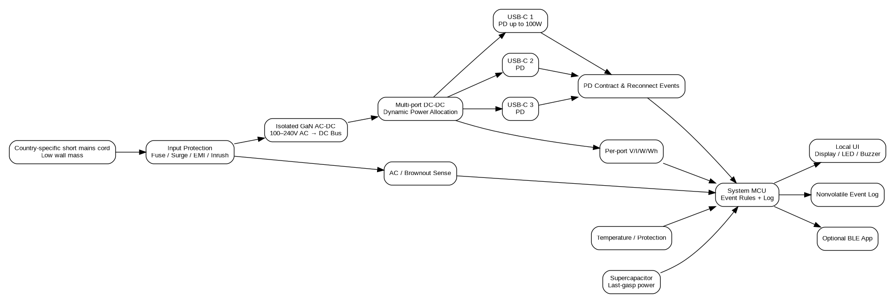

# Anker Atlas Relay

> 飞书「2026 AI 先锋未来人才大赛」安克创新命题

**Atlas Relay** 是一套面向高频跨国、多设备旅行者的高可靠 USB-C 供电概念：用地区短电源线把重型 GaN 主机从墙面移到桌面，并记录 AC 中断、USB-C 重连、异常低功率与温度事件。



## 项目要回答的问题

验证：
> AI 能否作为研究员、用户替身、反方评审和工程专家，形成一套可复用、可追溯、能否决错误假设的产品定义 SOP？

本项目从一个经验驱动的“大而全模块化旅行充电器”出发，经公开证据、竞品拆解、反方用户、力学模型和工程审查，逐步收敛为 Atlas Relay。

## 当前成果

- 经验驱动 Baseline V0 与决策日志；
- AI 原生工作流 V2 与角色/证据/假设数据结构；
- 竞品拆解和候选方案评分；
- 80 条公开讨论编码、37 个独立讨论链接；
- 墙端静态力矩数字仿真；
- 产品系统架构、能力边界和 FMEA；
- 可复现实体实验方案与测试矩阵；
- 产品外观、结构和用户流程；
- 报名开题文案；
- 可运行的确定性工作流演示和静态交互看板。

## 当前产品定义

| 模块 | 定义 |
|---|---|
| Country Cord | 按行程选带的低轮廓地区短电源线 |
| Relay Hub | 约 100W、3 × USB-C 的桌面 GaN 主机 |
| Charge Assurance | 记录 AC 中断、PD 重连、低功率、温度和累计能量 |
| Local-first UI | 本机状态优先，BLE 手机通知可选 |
| 明确不做 | AC 万能透传、电压转换、大容量电池、强制云端账号 |

详细定义见 [`docs/10_current_product_definition_v1.md`](docs/10_current_product_definition_v1.md)。

## AI 原生工作流

```text
Baseline
  → Evidence collection
  → Insight & JTBD extraction
  → Synthetic user stress test
  → Counter-evidence search
  → Engineering / safety review
  → Candidate scoring
  → Decision audit
  → Physical experiment
  → Evidence update
```

AI 不自动批准产品。核心机制是：**证据门槛、反方意见、能力边界和 Kill Criteria**。

## 仓库结构

```text
application/   报名开题文案与提交清单
engineering/   架构、FMEA、实验方案、测试台和数据模板
product/       工业设计、尺寸、用户流程和结构图
prototype/     工作流 mock 与静态交互看板
workflow/      Agent 角色、Prompt 与 JSON Schema
research/      竞品、公开证据、假设和来源索引
simulation/    墙端力矩模型
results/       仿真、评分、编码摘要与演示输出
docs/          命题、方法演化、决策与当前定义
scripts/       仓库完整性检查
```

完整目录说明见 [`REPOSITORY_MAP.md`](REPOSITORY_MAP.md)。

## 快速运行

```bash
python -m pip install -r requirements.txt
python simulation/torque_model.py
python prototype/workflow_orchestrator_mock.py
python scripts/validate_repo.py
```

静态看板：直接打开 [`prototype/dashboard/index.html`](prototype/dashboard/index.html)。

## 证据与诚信边界

本项目严格区分：

- 真实个人旅行经历；
- AI 合成用户；
- 公开网络讨论；
- 官方产品规格；
- 数字仿真；
- 未来实体实验。

`results/planning_not_experiment/` 中的数值仅用于实验规划，不得称为实体实验结果。当前也不得声称产品已通过 USB-IF、IEC、UL、CE、FCC 或其他认证。

详见 [`DISCLOSURE.md`](DISCLOSURE.md)。
